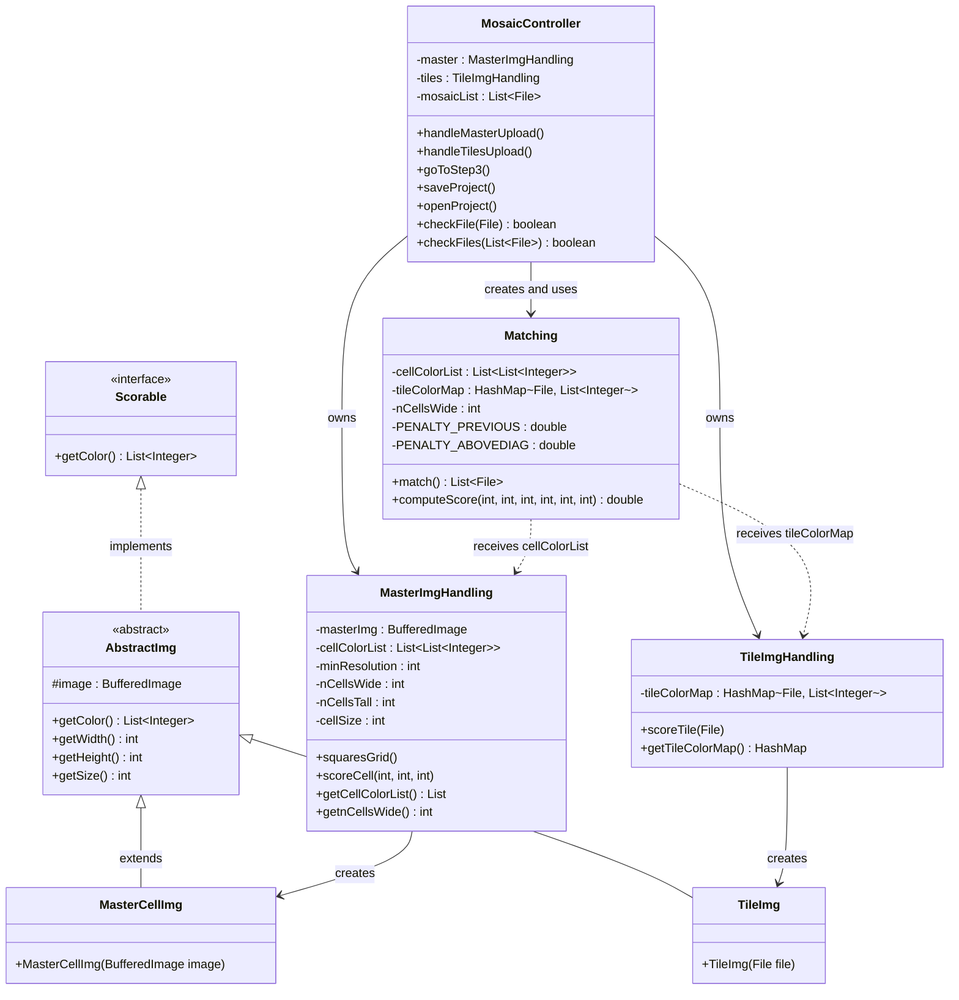

# Project Mosaic (not the browser)

### Lingo:
**Mosaic:** image of images. 
**Master image:** the image the user first uploads and want to replicate with a mosaic. 
**Grid:** the parts we split the master image into. The size of the grid is the same as the resolution of the mosaic. 
**Cell:** square in the grid. 
**Tiles:** the images the user uploads after the master, with which we make the mosaic.
**RGB:** color vaues of red, blue and green. Why not yellow? I don't know. 

---

## 1. Application Description

The Mosaic Generator takes any image and recreates it as a photo mosaic — (ai wrote this part coming, sry guys) a grid where each cell is replaced by a smaller image (tile) that best matches the color of that part of the original.

The user starts by uploading a **master image** and entering a **minimum grid resolution** (e.g. 10 means the shortest side is divided into at least 10 cells). `MasterImgHandling` reads the image, calculates the appropriate cell size, and walks across the image row by row, computing the average RGB value for each square cell. These values are stored as an ordered list.

Next, the user uploads a **library of tile images**. `TileImgHandling` processes each one, computing its average RGB and storing the results in a `HashMap<File, List<Integer>>`.

`Matching` then iterates over every cell and scores all tiles using a perceptually weighted color distance formula. Tiles that appeared in adjacent cells receive a score penalty to reduce repetition. The tile with the best score is selected for each cell. Also implemented some randomness here. Feel free to adjust the params. 

The resulting mosaic is rendered in an interactive, zoomable `GridPane` in the JavaFX UI. The project can be saved to and loaded from a `.txt` file, which stores the column count and the ordered list of tile file paths.

---

## 2. Class Diagram

The diagram below shows the main class relationships in the application. The key architectural decision is that `MosaicController` acts purely as a coordinator — it delegates all image processing to the model classes and never performs pixel-level operations itself.

**Assumption:** `MasterCellImg` and `TileImg` are not shown with full internal state for brevity — they inherit all color-scoring logic from `AbstractImg`.

---

## 3. OOP Reflection

### What OOP concepts are covered in the project?

The project covers several central OOP concepts.

**Encapsulation** is used throughout. Each class owns and protects its own state — `MasterImgHandling` keeps `cellColorList` and pixel dimensions private, exposing only what is needed through getters. `TileImgHandling` wraps its `HashMap` internally, and `Matching` maintains the `mosaicList` without letting callers modify it mid-computation. No class reaches into another class's fields directly; everything goes through defined methods.

**Inheritance** is used via the `AbstractImg` class. Both `MasterCellImg` (representing one cell cut from the master image) and `TileImg` (representing a full tile) share the same pixel-averaging logic. Rather than duplicating the `getColor()` method in both, this logic lives once in `AbstractImg` and both subclasses inherit it. This keeps the scoring logic consistent: whether we are scoring a cell or a tile, the algorithm is identical.

**Interface / contract-based design** is used with the `Scorable` interface, which declares `getColor()`. `AbstractImg` implements this interface, meaning both `MasterCellImg` and `TileImg` are guaranteed to be scorable by contract. This makes `Matching` not need to know whether it is comparing a master cell or a tile — both expose the same shape of data.

**Model-View-Controller (MVC)** is the overall architecture. `App.fxml` is the **View** — it defines the UI layout and binds buttons to controller methods without containing any logic. `MosaicController` is the **Controller** — it handles user events, validates input, and coordinates the flow. The **Model** consists of `MasterImgHandling`, `TileImgHandling`, and `Matching`, which handle all image processing and matching logic with no knowledge of the UI.

An important design challenge we worked through was that the upload button initially tried to do too much — it both took in the file and immediately processed the master image. This broke MVC by mixing controller responsibilities (responding to a user action) with model work (reading pixels). We decoupled this by separating upload (`handleMasterUpload`) from processing (`goToStep2`), so the controller only triggers the model when all inputs are ready.

### What OOP concepts could have been used more?

While the `Matching` class has penalty constants defined (`PENALTY_PREVIOUS`, `PENALTY_ABOVEDIAG`, etc.), the matching algorithm is a single monolithic method. A more extensible design could have used a strategy pattern — a `MatchingStrategy` interface — so different scoring approaches could be swapped in without rewriting `Matching` itself.

### Testing

Testing was done primarily through manual end-to-end runs: uploading a range of master images (landscape, portrait, square), varying tile library sizes, and checking the visual output. We also tested the save/load cycle by saving a project to `.txt` and reopening it.

For the `checkFile` and `checkFiles` methods in `MosaicController` (which validate file formats), the logic is straightforward enough that unit tests would have been quick to write and high-value — for example, asserting that `.txt` files are rejected and that `null` input returns `false`.

---

## 4. AI Declaration
**Now, the big question**, the __AI__ question. It is now me, the human Kristoffer, writing this. After a fun and intensive period of working on this project, I can with sincerly say that this is one of the projects I have done where I have __*really*__ tried to think more myself, without AI. This made it hard, fun and a experienec filled with revelations. It was fun writing the logic, but major parts of the frontend, except for the fun logic and the parts ochestrating it all, are written with the help of Gemini Pro. Thanks. Also, the text answering the questions with the flawless english is written by Sonnet 4.6. I truly believe AI is here to stay, and that we optimistically that we are all slightly doomed (for the better?). 
